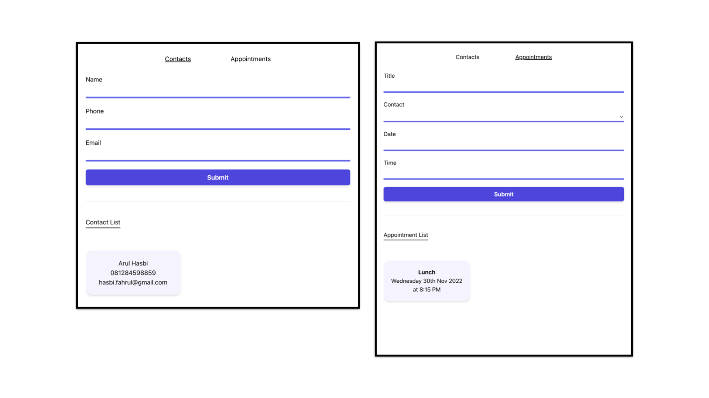

# Appointment Planner

Hi, it's me again with another react project from codecademy full-stack engineer course path. This time I built an appointment planner app which only consists of two pages: Contacts and Appointments.

### Project Description

To do the project, actually codecademy provides a dedicated walkthrough, but I decided not to follow it. Instead, I challenge myself to come up with ideas on how the appointment planner would looks like, but in its simple, beginner-friendly form and yet still demonstrate the _appointment planner_. In the end, the point of this project is to acquaint myself more about react library and its features like life-cycle, hooks, router, etc. 

1.  Contact Page

    - Fetch all contact (if any) and displays it through horizontal scrolling
    - Save a new contact by receiving inputs (name, phone, & email) from users

2.  Appointment Page

    - Fetch all appointment (if any) and displays it through horizontal scrolling
    - Save a new appointment by receiving inputs (title, contact, date, & time) from users

### Project Screen Shots

### Dependencies

- [formik](https://formik.org/): `^2.2.9`
- [moment](https://momentjs.com/docs/): `^2.29.4`
- [msw](https://mswjs.io/docs/): `^0.47.4`
- [react-datepicker](https://reactdatepicker.com/): `^4.8.0`
- [@mswjs/data](https://github.com/mswjs/data): `^0.10.2`
- [@faker-js](https://fakerjs.dev/): `^7.6.0`
- [styled-components](https://styled-components.com/): `^5.3.6`
- [react-router-dom](https://v5.reactrouter.com/web/guides/quick-start): `^6.4.3`
- [Tailwind CSS](https://tailwindcss.com/): `^3.2.1`

### Available Scripts

In the project directory, you can run:

### `npm install`

To install all of the needed dependencies, then:

### `npm start`

Runs the app in the development mode.\
Open [http://localhost:3000](http://localhost:3000) to view it in your browser.

You may also see any logs in the console when performing any form submission event.
